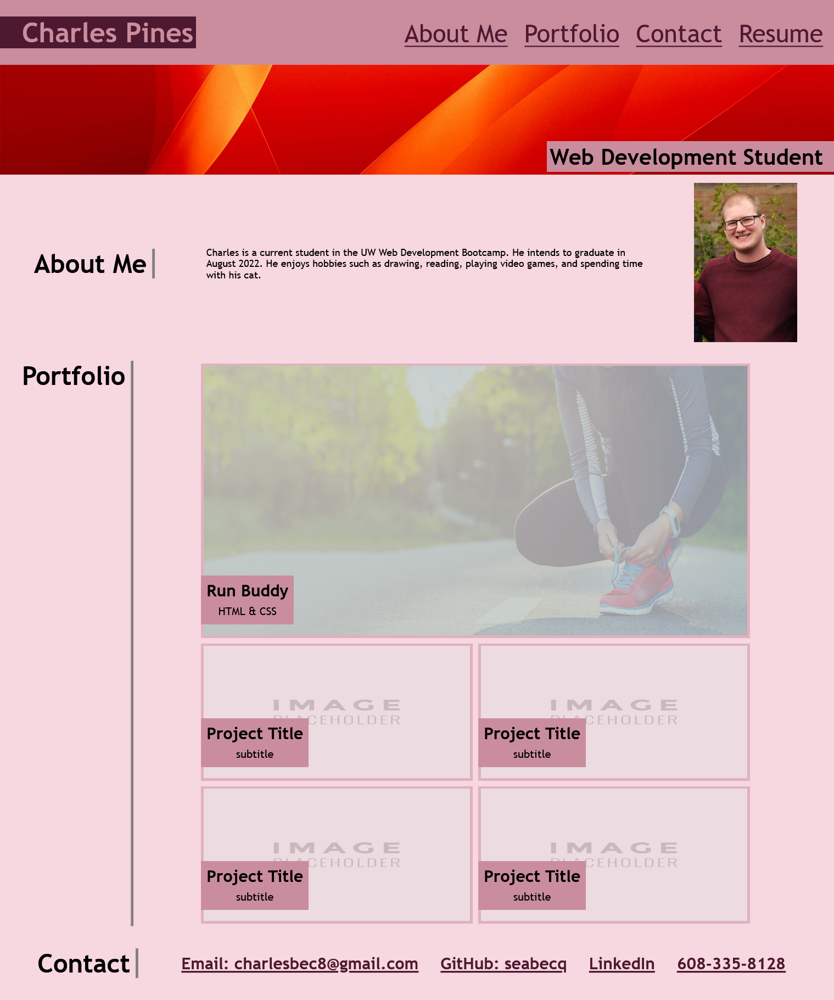

# portfolio

## Description

The goal of this project was to make a professional looking portfolio using HTML and CSS. Ideally this will one day be able to be shown to potential employers to demonstrate proficency with HTML and CSS and the other languages included in the eventual linked projects. 

Addtionally, the portfolio uses flexboxes and media queries to adapt to screen sizes and enchance website responsivity. There are also some uses of pseudo classes for image aesthetics.

## Website Link 

https://seabecq.github.io/portfolio/

## Screenshot

